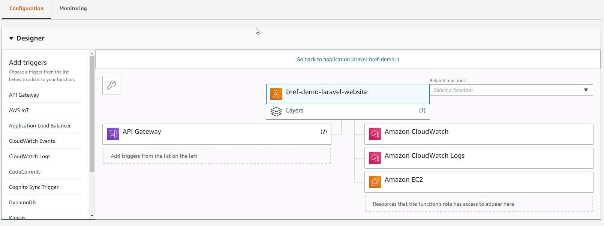
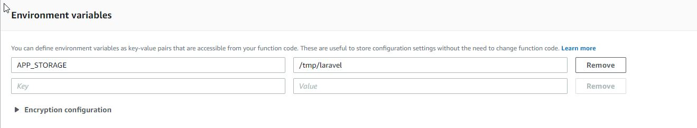
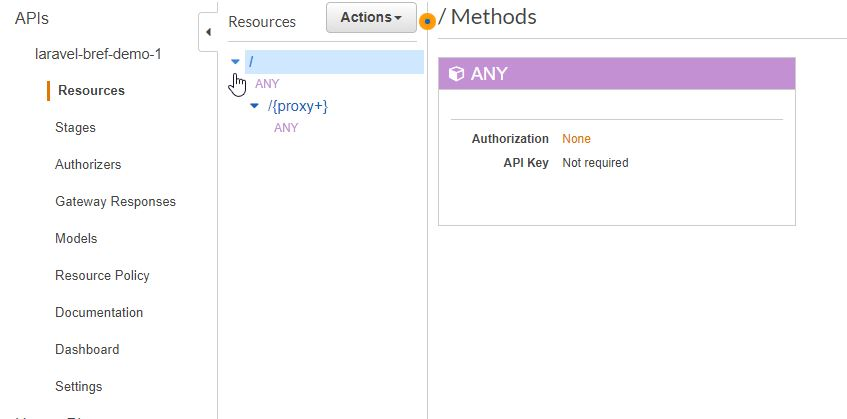

# AWS Presentation

**Table of Contents**

- [Why ServerLess](#Why_ServerLess)
- [Lambda Functions](#Lambda_functions)
  - [Storage](#Storage)
  - [Application Data](#Application_Data)
  - [Laravel](#Laravel)
- [API Gateway](#API_Gateway)
- [Architecture](#Architecture)
- [SAM](#Sam)
- [Amplify](#Amplify)

## Why ServerLess

Serverless replaces the traditional approaches to running applications.

With serverless:

- We don't manage, update, configure, provision servers or containers,
- We don't reserve or scale servers or containers, instead they are scaled automatically and transparently for us.
- We don't pay for fixed resources, instead we pay for what we actually use (e.g. execution time).

**Serverless can provide more scalable, affordable and reliable architectures for less effort.** <sup>[See more](https://bref.sh/docs/).</sup><br>

# Lambda Functions

**AWS Lambda** is a compute service that lets you run code without provisioning or managing servers. **AWS Lambda** executes your code only when needed and scales automatically, from a few requests per day to thousands per second. You pay only for the compute time you consume - there is no charge when your code is not running. With **AWS Lambda**, you can run code for virtually any type of application or backend service - all with zero administration. **AWS Lambda** runs your code on a high-availability compute infrastructure and performs all of the administration of the compute resources, including server and operating system maintenance, capacity provisioning and automatic scaling, code monitoring and logging. All you need to do is supply your code in one of the languages that AWS Lambda supports.<sup>[See more](https://docs.aws.amazon.com/lambda/latest/dg/welcome.html)</sup><br>

## Storage

The filesystem on AWS Lambda is **read-only**, except for the **/tmp** directory.

Application data must not be stored in **/tmp** because of the behavior described above.
Instead data can be stored in databases or in storage services like **AWS S3**.

## Application Data

Application data must not be stored in **/tmp** because of the behavior described above.

Instead data can be stored in databases or in storage services like **AWS S3**.

## Laravel

There is no built-in support for PHP on AWS Lambda. Instead we need to use 3rd party runtimes via the system of Lambda layers. Example: [Bref](https://github.com/mnapoli/bref)

Example: [laravel](https://5jrawet8pl.execute-api.us-east-2.amazonaws.com/Prod)

## Dashboard



## Application cache

Performance-wise, using AWS S3 for storing the application cache is not ideal.

The following solutions can be used instead:

- pre-generate the cache in the project directory before deploying
- store the cache into the /tmp directory
- store the cache into a distributed cache service like Memcache or Redis



# API Gateway

Amazon API Gateway is an AWS service for creating, publishing, maintaining, monitoring, and securing REST and WebSocket APIs at any scale. API developers can create APIs that access AWS or other web services as well as data stored in the AWS Cloud. As an API Gateway API developer, you can create APIs for use in your own client applications (apps). Or you can make your APIs available to third-party app developers. For more information, see Who Uses API Gateway?.

API Gateway creates REST APIs that:

- Are HTTP-based.
- Adhere to the REST protocol, which enables stateless client-server communication.
- Implement standard HTTP methods such as GET, POST, PUT, PATCH and DELETE.

<sup>[See more](https://docs.aws.amazon.com/apigateway/latest/developerguide/welcome.html)</sup><br>



# Architecture


# SAM


The AWS Serverless Application Model (AWS SAM) is an open-source framework that you can use to build serverless applications on AWS.

You can use AWS SAM to define your serverless applications. AWS SAM consists of the following components:

## Benefits of Using AWS SAM

Because AWS SAM integrates with other AWS services, creating serverless applications with AWS SAM provides the following benefits:

- **Single-deployment configuration**. AWS SAM makes it easy to organize related components and resources, and operate on a single stack. You can use AWS SAM to share configuration (such as memory and timeouts) between resources, and deploy all related resources together as a single, versioned entity.

- **Extension of AWS CloudFormation**. Because AWS SAM is an extension of AWS CloudFormation, you get the reliable deployment capabilities of AWS CloudFormation. You can define resources by using AWS CloudFormation in your AWS SAM template. Also, you can use the full suite of resources, intrinsic functions, and other template features that are available in AWS CloudFormation.

- **Built-in best practices**. You can use AWS SAM to define and deploy your infrastructure as config. This makes it possible for you to use and enforce best practices such as code reviews. Also, with a few lines of configuration, you can enable safe deployments through CodeDeploy, and can enable tracing by using AWS X-Ray.

```yaml
AWSTemplateFormatVersion: "2010-09-09"
Transform: AWS::Serverless-2016-10-31
Description: "Bref demo for Laravel"

Globals:
  Function:
    Environment:
      Variables:
        # Laravel environment variables
        APP_STORAGE: "/tmp/laravel"

Resources:
  Website:
    Type: AWS::Serverless::Function
    Properties:
      FunctionName: "bref-demo-laravel-website"
      CodeUri: .
      Handler: public/index.php
      Timeout: 30 # in seconds (API Gateway has a timeout of 30 seconds)
      Runtime: provided
      Layers:
        - "arn:aws:lambda:us-east-2:209497400698:layer:php-73-fpm:1"
      Events:
        # The function will match all HTTP URLs
        HttpRoot:
          Type: Api
          Properties:
            Path: /
            Method: ANY
        HttpSubPaths:
          Type: Api
          Properties:
            Path: /{proxy+}
            Method: ANY
  Console:
    Type: AWS::Serverless::Function
    Properties:
      FunctionName: "bref-demo-laravel-artisan"
      CodeUri: .
      Handler: artisan
      Timeout: 120
      Runtime: provided
      Layers:
        # PHP runtime
        - "arn:aws:lambda:us-east-2:209497400698:layer:php-73:1"
        # Console layer
        - "arn:aws:lambda:us-east-2:209497400698:layer:console:1"

# Outputs show up in the CloudFormation dashboard
Outputs:
  DemoHttpApi:
    Description: "URL of our function in the *Prod* environment"
    Value: !Sub "https://${ServerlessRestApi}.execute-api.${AWS::Region}.amazonaws.com/Prod/"
```

## Makefile

```
deploy:
	php artisan config:clear
	sam package --output-template-file .stack.yaml --region us-east-2 --s3-bucket {BUCKET}
	sam deploy  --template-file .stack.yaml --capabilities CAPABILITY_IAM --region us-east-2 --stack-name laravel-bref-demo-1
```

# Amplify

At a high level, **Amplify** revolves around the ‘**aws-exports**’ file. This file is generated by the Amplify CLI, and contains information about the serverless resources you create with the CLI.

The **Amplify** Library then reads the JSON in this file when you pass it to the Amplify.configure method. Once the **Amplify** Library has been configured, it can access your AWS resources.

Finally, the **Amplify** UI components can then use the **Amplify** library to automatically perform tasks such as authentication, S3 uploads, etc.

You can use the **Amplify CLI** and the **Amplify** Library/UI Components separately, but they are most powerful when used together.

Example: [example](http://awsreactfrontendexam-20190417075706-hostingbucket-dev.s3-website.us-east-2.amazonaws.com/)<br>
Github: [todo-frontend](https://github.com/krasovsky22/aws-react-frontend-example)
